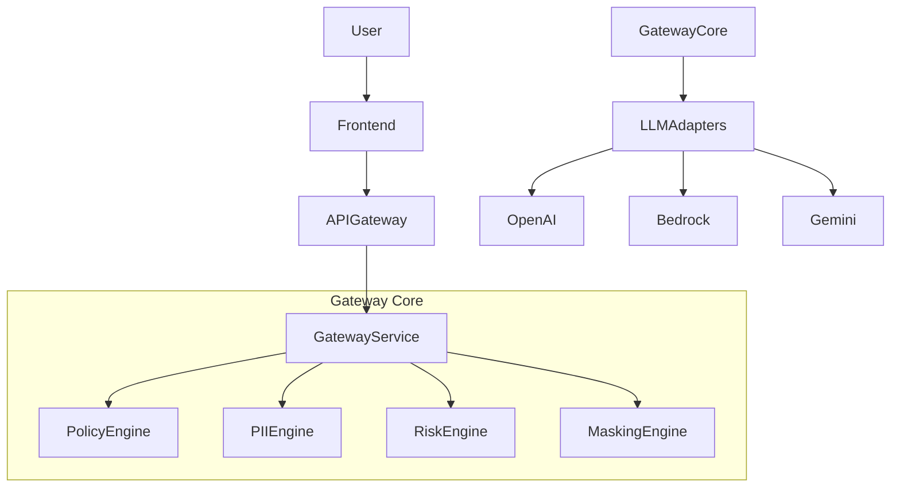

# SecureGenAI Gateway

Enterprise AI Security Firewall for AWS.

## Project Vision
SecureGenAI Gateway is an enterprise-grade AI security layer designed to protect organizations from accidental or malicious data leakage when employees use Generative AI tools. 
The platform acts as a centralized gateway between users and LLM providers such as OpenAI, AWS Bedrock, Anthropic Claude, and Google Gemini.

### Security Guarantees
Before prompts reach an LLM:
- PII is detected
- Sensitive data is masked
- Policies are enforced
- Risks are scored

After responses return:
- Output validation occurs
- Compliance checks execute
- Audit logs are generated

## High-Level Architecture


## Tech Stack
- **Frontend**: React 19, TypeScript, Material UI, Redux Toolkit
- **Backend**: Java 21, Spring Boot 3, Spring Security, Spring Cloud
- **Database**: PostgreSQL, Redis
- **Cloud & DevOps**: AWS, Docker, docker-compose

## Prerequisites
- Docker & Docker Compose
- Java 21 (for local development without Docker)
- Node.js 20+ (for local frontend development)

## Getting Started

1. Clone the repository.
2. Ensure Docker daemon is running.
3. Run the following command from the root directory to spin up the infrastructure and microservices:
   ```bash
   docker-compose up -d
   ```
4. Access the frontend application at `http://localhost:5173`.
5. Access the API Gateway at `http://localhost:8080`.

## Microservices Overview
- `gateway-service`: Entry point, routing, auth, tenant identification.
- `policy-service`: Policy evaluation (ALLOW, WARN, BLOCK).
- `pii-service`: Sensitive data detection via regex and models.
- `masking-service`: Masks PII tokens before reaching LLM.
- `risk-engine-service`: Calculates security risk scores.
- `audit-service`: Logs prompts, responses, and compliance checks.
- `notification-service`: Sends security alerts via Slack or Email.

## License
Confidential and Proprietary. All Rights Reserved.
